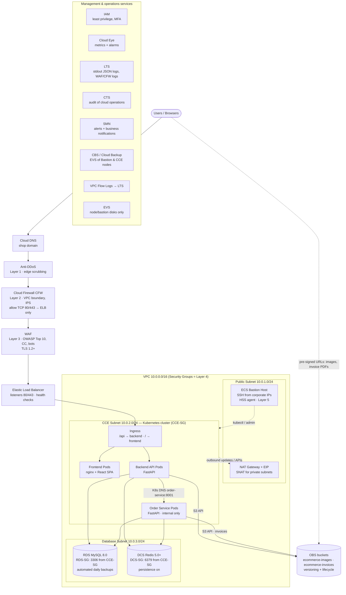
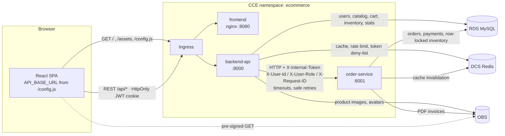
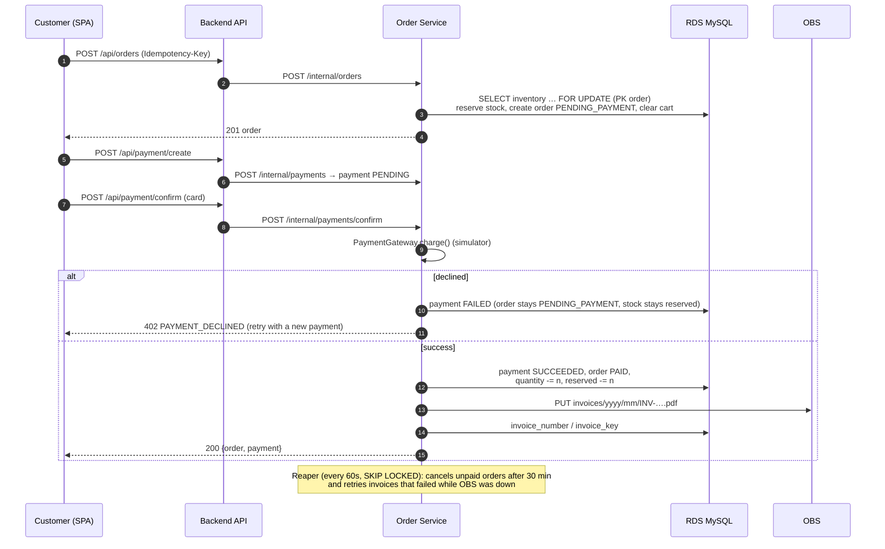
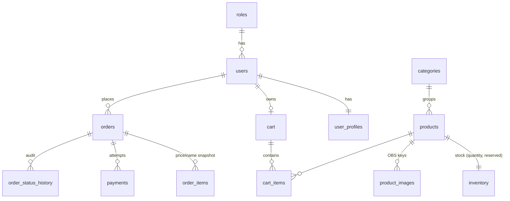

# Architecture

Plan B e-commerce platform for the **Pardis Cloud Phase 1, Single VPC** topology
(source of truth: *Pardis Cloud – Simple E-commerce Application Topology, Phase 1*).

## 1. Cloud deployment (Phase 1, single VPC `10.0.0.0/16`)

| Layer / service | How the application uses it |
|---|---|
| Cloud DNS, Anti-DDoS, CFW, WAF | Transparent to the app. The app never assumes direct internet exposure and trusts `X-Forwarded-*` only from `TRUSTED_PROXIES` (VPC / pod CIDRs). |
| ELB | Health checks on `/health` (frontend) or `/api/health` (backend). TLS terminates at ELB/WAF; the app uses `X-Forwarded-Proto` for HSTS and secure cookies. |
| CCE | 3 Deployments, 3 ClusterIP Services, 1 Ingress, HPA, PDB and NetworkPolicies ([`infrastructure/kubernetes`](../infrastructure/kubernetes)). |
| RDS MySQL | The only system of record. SQLAlchemy connection pool with `pool_pre_ping` and `pool_recycle`; Alembic migrations run as a Job. |
| DCS Redis | Catalog/cart cache, JWT deny-list (logout), rate limiting, active-user tracking. Fail-soft: if Redis is down, the app degrades to RDS. |
| OBS | `StorageService` S3 adapter. Keys `images/products/…`, `images/avatars/…`, `invoices/{yyyy}/{mm}/…`; private buckets plus pre-signed URLs. |
| NAT Gateway | Pods have no public IPs. Outbound traffic (for example the OBS public endpoint or an SMN webhook) goes through SNAT. |
| Bastion (ECS) + HSS | Operators run `kubectl` and migrations from the bastion; the app itself needs nothing. |
| Cloud Eye | Prometheus `/metrics` (via CCE cloud-native monitoring) plus ELB/RDS/DCS/OBS native metrics. |
| LTS | JSON logs on stdout/stderr, collected from CCE pods. |
| CTS | Records cloud-level changes. The app adds its own audit events (`ORDER_STATUS_CHANGED`, `INVENTORY_UPDATED`, …) in LTS. |
| SMN | `NotificationService` (`log` or `webhook` adapter) publishes business events. Cloud Eye alarms go to SMN topics. |
| CBS / EVS | Only node and bastion disks. The app stores no state on EVS (no PVCs). |
| IAM | A dedicated IAM user or agency for OBS, limited to the two buckets. Operators get separate accounts. |

## 2. Internal application communication

### Responsibilities

| Component | Owns | Talks to |
|---|---|---|
| **Frontend** (`frontend/`) | UI only. Runtime config (`API_BASE_URL`) comes from `/config.js`, rendered by nginx from env vars. | Backend via REST; OBS via pre-signed URLs |
| **Backend API** (`backend/`) | Public REST API: auth, profile, catalog, categories, images, cart, inventory, admin, statistics. Authenticates users and enforces roles. | RDS, Redis, OBS, Order Service |
| **Order Service** (`order-service/`) | Order placement, stock reservation, payment gateway (simulator), invoice PDF generation, status state machine, expiry of unpaid orders. | RDS, Redis, OBS |
| **ecommerce_common** (`libs/common/`) | Config, models, JSON logging, metrics, middleware, error envelope, adapters (`StorageService`, `CacheService`, `NotificationService`). | – |

### Order and payment workflow

Order states: `PENDING_PAYMENT → PAID → PROCESSING → SHIPPED → DELIVERED`, and `CANCELLED` from `PENDING_PAYMENT` (reservation released) or from `PAID`/`PROCESSING` (stock returned, payment `REFUNDED`).

> **Deviation from the brief (recorded on purpose):** the brief lists *Payment → Order Created*.
> To prevent overselling, the order record is created first as `PENDING_PAYMENT` with stock
> **reserved**. The order becomes *confirmed* (`PAID`) and inventory is actually **reduced** only
> when payment succeeds. The customer-facing flow is the same.

## 3. Data model (RDS MySQL)

* Money is stored as `DECIMAL(12,2)`. Timestamps are stored as UTC `DATETIME` and returned with an explicit offset.
* Constraints: unique SKU, slug, e-mail, `(cart_id, product_id)` and `(user_id, idempotency_key)`. Check constraints enforce non-negative stock and price.
* Indexes cover the hot paths: product listing (`is_active, created_at`), order history (`user_id, created_at`) and the admin order filter (`status, created_at`).
* Products are soft-deleted so order history keeps its references.

## 4. Cloud design rules and how they are met

| Rule | Implementation |
|---|---|
| Stateless containers | No local state. Read-only root filesystem, `emptyDir` `/tmp` only for upload spooling. The local storage adapter is refused outside development. |
| Persistent data in RDS/OBS/Redis | Orders, users and catalog in RDS; binaries in OBS; cache/sessions in DCS. |
| No hard-coded IPs or credentials | Everything comes from env / ConfigMap / Secret. Services are found through K8s DNS (`order-service:8001`). Production config validation rejects placeholders. |
| Probes | `/health` = liveness (process only); `/ready` = readiness (RDS + Redis when `REDIS_REQUIRED`). A draining pod returns 503. |
| Horizontal scaling | One Uvicorn worker per pod, HPA on CPU/memory, `FOR UPDATE` row locks and idempotency keys make multi-replica writes safe. |
| Structured logging | JSON lines with `request_id`, `user_id`, method, route, status, duration and client IP; secrets are masked. |
| Graceful shutdown | `preStop: sleep 10` lets endpoints deregister; Uvicorn `--timeout-graceful-shutdown 25`; `terminationGracePeriodSeconds: 45`. |
| Timeouts / safe retries | DB connect 5s / read 30s; Redis 1s; OBS connect 3s / read 15s; order-service 10s. Only GETs and idempotent POSTs (`Idempotency-Key`, payment confirm) are retried. |
| Idempotency | `Idempotency-Key` on order placement (unique per user), one open payment per order, and idempotent confirm. |
| Backups | RDS native automated backups, OBS versioning/lifecycle, CBS for EVS. The app has no backup code. |

## 5. Security architecture

* **Authentication:** bcrypt (cost 12) password hashes and HS256 JWTs with `exp`/`iss`/`jti`. Browsers get the token in an **HttpOnly, SameSite** cookie (`Secure` in production), so no token lives in `localStorage`. API clients can use `Authorization: Bearer`. Logout puts the `jti` on a Redis deny-list.
* **Authorization:** roles `ADMIN` / `CUSTOMER`. `require_admin` guards every `/api/admin/*` route and all catalog writes, and customers only ever see their own cart, orders and payments.
* **Service-to-service:** the Order Service requires `X-Internal-Token`, compared in constant time, and a NetworkPolicy lets only backend pods reach it. The Ingress never routes to it.
* **Input handling:** Pydantic validation; markup characters rejected in text fields; parameterised SQLAlchemy queries; escaped `LIKE` patterns; uploaded images decoded and re-encoded (which also strips EXIF metadata); 5 MB cap; decompression-bomb guard.
* **HTTP hardening:** CSP, `X-Frame-Options: DENY`, `nosniff`, `Referrer-Policy`, HSTS behind HTTPS, and a strict CORS allow-list with credentials.
* **Abuse protection:** per-IP rate limits in Redis (general 300/min, auth 20/min) sit behind the WAF's CC protection.
* **Errors:** one envelope with a `request_id`; stack traces are only logged. DB, Redis, OBS and order-service outages map to 503 plus `Retry-After`.
* **Containers:** non-root users, all capabilities dropped, `seccomp: RuntimeDefault`, read-only root filesystem, and the Pod Security Admission `restricted` profile.
